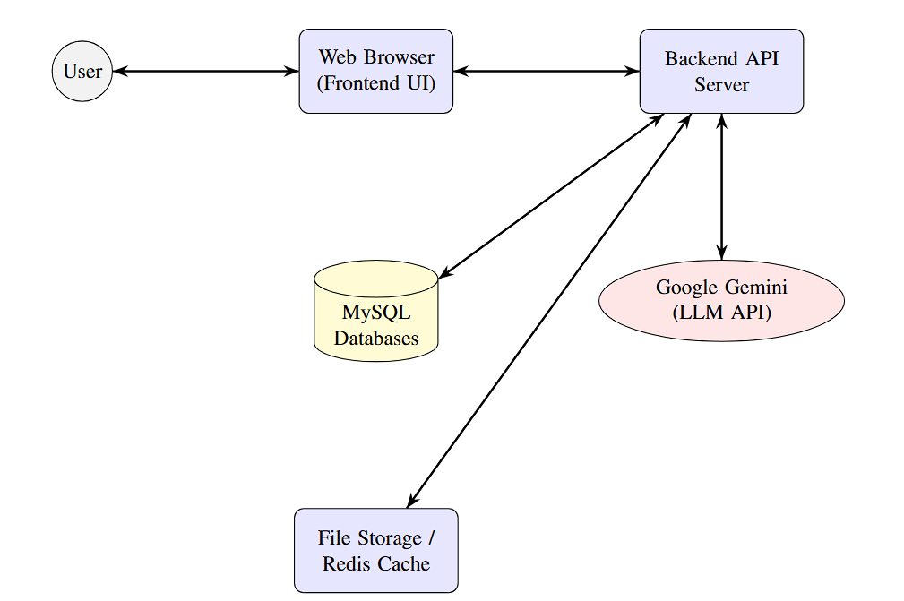
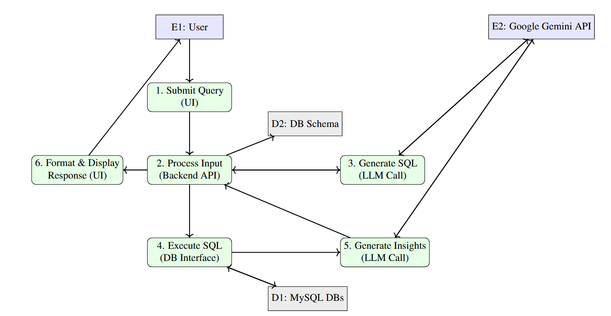
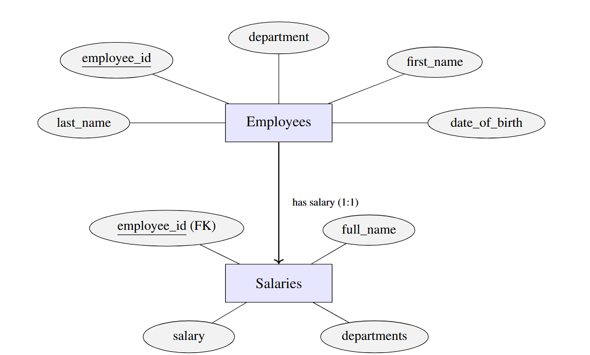
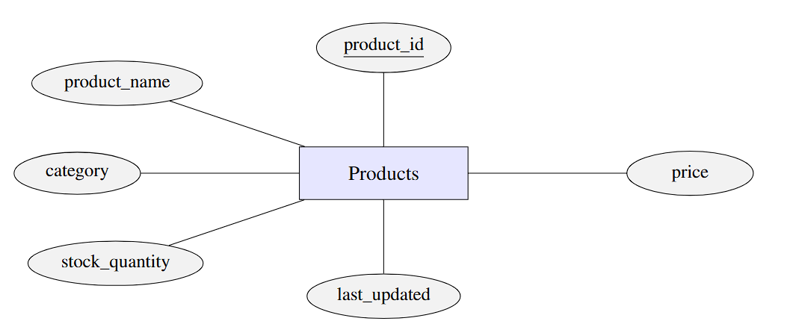
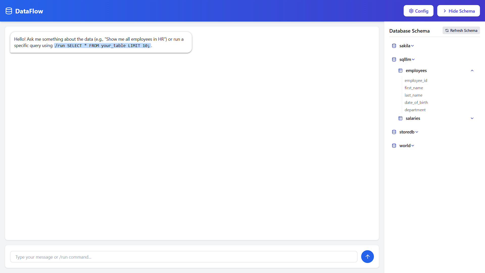
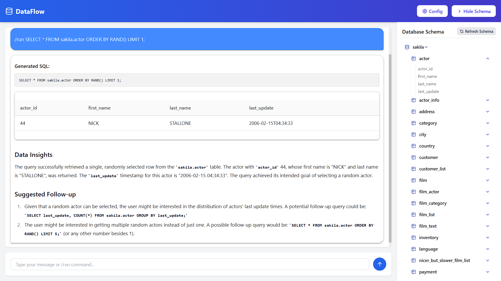
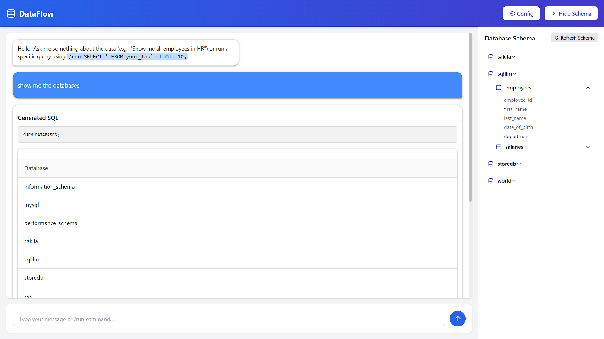

# 🤖 SQL-Sense: Your Intelligent Database Assistant

[](https://www.python.org/downloads/)
[](https://fastapi.tiangolo.com/)
[](LICENSE)
[](#)
[](#-contributing)

SQL-Sense bridges the gap between humans and relational data. Ask questions in plain English and instantly receive optimized SQL, live results, and AI-generated insights – all without leaving the browser. ✨

---

## 📚 Table of Contents

1. [Why SQL-Sense?](#-why-sql-sense)
2. [Key Features](#-key-features)
3. [Project Showcase](#-project-showcase)
4. [Technologies and Core Libraries](#-technologies-and-core-libraries)
5. [Setup and Installation](#-setup-and-installation)
6. [How to Use](#-how-to-use)
7. [API Endpoints](#-api-endpoints)
8. [Troubleshooting & FAQ](#-troubleshooting--faq)
9. [Project Structure](#project-structure)
10. [Contributing](#-contributing)
11. [License](#-license)
12. [Acknowledgements](#-acknowledgements)

---

## ❓ Why SQL-Sense?

Traditional SQL clients are great at running queries—but they assume you already *know* SQL and your schema inside-out. SQL-Sense removes that barrier:

* **No more context-switching.** Ask questions in plain language and stay focused on your analysis.
* **Instant productivity.** New teammates or non-technical stakeholders can explore data without a crash-course in SQL.
* **Better insights, faster.** AI-generated summaries highlight trends you might miss in raw tables.
* **Safety first.** Potentially destructive queries are intercepted and require explicit confirmation.

---

## ✨ Key Features

-   **🤖 Natural Language to SQL:** Ask questions in English; get SQL queries in return.
-   **🚀 Direct SQL Execution:** A `/run` command to execute raw SQL queries for power users.
-   **📈 AI-Powered Insights:** Automatically generates summaries and insights from query results.
-   **👁️ Dynamic Schema Viewer:** An interactive sidebar displays your database schemas and tables in real-time.
-   **💬 Modern Chat Interface:** A sleek, responsive, and user-friendly chat UI for a seamless experience.
-   **⚙️ Tech Stack:** Powered by FastAPI, Google Gemini, MySQL, and a clean HTML/TailwindCSS frontend.

---

## 🚀 Project Showcase

A visual tour of SQL-Sense, from its architecture to its user interface.

<details>
<summary><strong>🏛️ System Architecture & Workflow (Click to Expand)</strong></summary>

<p align="center">
  <strong>1. High-Level System Architecture</strong><br>
  <em>The main components of the system: UI, FastAPI Backend, SQL Database, and the Gemini LLM.</em>
</p>
<p align="center">
  
</p>

<p align="center">
  <strong>2. Application Workflow</strong><br>
  <em>From user prompt to AI-generated SQL, data retrieval, and final insights.</em>
</p>
<p align="center">
  
</p>

</details>

<details>
<summary><strong>🗄️ Database Schema (Click to Expand)</strong></summary>

<p align="center">
  <strong>Employee & Salary Schema</strong><br>
  <em>ER Diagram for the `Employees` and `Salaries` tables.</em>
</p>
<p align="center">
  
</p>

<p align="center">
  <strong>Product Schema</strong><br>
  <em>ER Diagram for the `Product` table.</em>
</p>
<p align="center">
  
</p>

</details>

<details>
<summary><strong>💻 User Interface (Click to Expand)</strong></summary>

<p align="center">
  <strong>Main Chat Interface</strong><br>
  <em>The primary UI where users interact with the SQL agent.</em>
</p>
<p align="center">
  
</p>

<p align="center">
  <strong>Query Results & Insights</strong><br>
  <em>An example of the application returning query results, generated SQL, and AI-driven insights.</em>
</p>
<p align="center">
  
</p>

<p align="center">
  <strong>Database Schema Viewer</strong><br>
  <em>The collapsible sidebar allows users to browse the connected database schemas and tables.</em>
</p>
<p align="center">
  
</p>

</details>

---

## 🛠️ Technologies and Core Libraries

<table align="center">
  <tr>
    <td align="center" width="140">
      <a href="https://www.python.org/" target="_blank" rel="noreferrer">
        
      </a>
      <br><strong>Python</strong>
    </td>
    <td align="center" width="140">
      <a href="https://fastapi.tiangolo.com/" target="_blank" rel="noreferrer">
        
      </a>
      <br><strong>FastAPI</strong>
    </td>
     <td align="center" width="140">
      <a href="https://deepmind.google/technologies/gemini/" target="_blank" rel="noreferrer">
        
      </a>
      <br><strong>Google Gemini</strong>
    </td>
    <td align="center" width="140">
      <a href="https://www.mysql.com/" target="_blank" rel="noreferrer">
        
      </a>
      <br><strong>MySQL</strong>
    </td>
    <td align="center" width="140">
      <a href="https://tailwindcss.com" target="_blank" rel="noreferrer">
        
      </a>
      <br><strong>TailwindCSS</strong>
    </td>
    <td align="center" width="140">
      <a href="https://developer.mozilla.org/en-US/docs/Glossary/HTML5" target="_blank" rel="noreferrer">
        
      </a>
      <br><strong>HTML5</strong>
    </td>
  </tr>
</table>

---
## ⚙️ Setup and Installation

Follow these steps to get SQL-Sense running on your local machine.

### 1. Prerequisites

-   **Python 3.11+**
-   **Git**
-   An active **MySQL** database service.

### 2. Clone the Repository
```bash
git clone https://github.com/UtkarshPrajapati/SQL-Sense.git
cd SQL-Sense
```

### 3. Set Up Virtual Environment

It's highly recommended to use a virtual environment to manage project dependencies.

```bash
# Create a virtual environment
python -m venv venv

# Activate it
# On Windows:
venv\Scripts\activate
# On macOS/Linux:
source venv/bin/activate
```

### 4. Configure Environment Variables

You'll need to provide your database credentials and Gemini API key.

1.  Create a new file named `.env` in the root of the project.
2.  Copy the contents of `.env.example` into it and fill in your details.

<details>
<summary><strong>Example `.env` structure (Click to Expand)</strong></summary>

```
# MySQL Database Configuration
MYSQL_HOST=localhost
MYSQL_USER=root
MYSQL_PASSWORD=your_mysql_password
MYSQL_DATABASE=sqlllm

# Google Gemini API Configuration
GEMINI_API_KEY=your_gemini_api_key
```
</details>

### 5. Install Dependencies
```bash
pip install -r requirements.txt
```

### 6. Prepare the Database

Run the provided script to create the necessary tables and populate them with realistic sample data.

```bash
python gen-data.py
```
This script will create two databases:
1.  **`sqlllm`** (or the value of `MYSQL_DATABASE` in `.env`): Contains `employees` and `salaries` tables.
2.  **`StoreDB`** (or the value of `MYSQL_DATABASE_STORE` in `.env`): Contains the `products` table.

It will then populate these tables with sample data.

### 7. Run the Application
You're all set! Start the FastAPI server using Uvicorn.
```bash
uvicorn sql_assistant:app --reload
```
The `--reload` flag enables hot-reloading for development. The application will be live at **http://127.0.0.1:8000**.

---

## 📖 How to Use

1.  **Open the Web Interface:** Navigate to `http://127.0.0.1:8000` in your web browser.
2.  **View Schema:** Click the "Show Databases" button to see the tables and columns the AI is aware of.
3.  **Ask a Question:** Type a question in plain English, like `show me all employees and their salaries`.
4.  **Execute Direct SQL:** For precise control, use the `/run` command followed by a SQL query. For example: `/run SELECT product_name, price FROM products WHERE price > 50;`
5.  **Review Results:** The application will display the generated SQL, the data results in a table, and a summary of insights derived by the AI.

---

## 🔗 API Endpoints

| Method | Endpoint | Description |
|--------|----------|-------------|
| **GET** | `/` | Serves the `index.html` single-page application. |
| **GET** | `/schema` | Returns JSON containing databases, tables, and columns the assistant can access. |
| **POST** | `/config` | Body: `{ "mysql_host": "...", "mysql_user": "...", "mysql_password": "...", "mysql_database": "...", "gemini_api_key": "..." }` – Updates connection credentials and tests them. |
| **POST** | `/chat` | Body: `{ "message": "<natural-language question or /run <SQL>>" }` – Main interaction endpoint: accepts NL queries or `/run` SQL commands, returns results/insights. |
| **POST** | `/execute_confirmed_sql` | Body: `{ "query": "<SQL previously flagged for confirmation>" }` – Executes DDL/DML queries that the user has reviewed and approved. |

All responses are JSON and follow the shape documented in the code. Unhandled errors are returned with appropriate HTTP status codes.

---

## 🛟 Troubleshooting & FAQ

<details>
<summary><strong>The server starts but `/schema` returns an empty list</strong></summary>

**Cause:** The MySQL credentials in your `.env` file don't have permission to see user databases, or no user databases exist.

**Fix:**
1. Verify `MYSQL_USER` / `MYSQL_PASSWORD` in `.env`.
2. Check that your user has at least `SELECT` privilege on the target databases.
3. Use the `/config` endpoint (or restart the app) after updating credentials.
</details>

<details>
<summary><strong>Gemini replies with "Error: Gemini API not configured"</strong></summary>

The `GEMINI_API_KEY` environment variable is missing or invalid.

* Obtain an API key from Google AI Studio.
* Add it to your `.env` file and/or update via the `/config` endpoint.
* Restart the backend (or let `/config` re-initialize the key).
</details>

<details>
<summary><strong>"Client does not support authentication protocol" MySQL error</strong></summary>

Your MySQL server may be using the newer `caching_sha2_password` plugin while the connector expects `mysql_native_password`.

```sql
ALTER USER 'root'@'%' IDENTIFIED WITH mysql_native_password BY 'your_password';
FLUSH PRIVILEGES;
```

Alternatively, create a dedicated read-only user for SQL-Sense with compatible auth.
</details>

<details>
<summary><strong>The UI shows "pending..." after I submit a question</strong></summary>

Check the backend logs; the LLM may be taking longer than expected or returning a safety block. Increase the `timeout` on your HTTP client if you've reverse-proxied the API.
</details>

---

## Project Structure
```
.
├── .env.example        # Environment variable template
├── .gitignore          # Files to ignore for git
├── README.md           # This file
├── assets              # Images and architectural diagrams
├── gen-data.py         # Generates and populates the database
├── index.html          # Main frontend file
├── requirements.txt    # Python dependencies
├── sql_assistant.py    # FastAPI backend logic
└── venv                # Virtual environment folder
```

---

## 🤝 Contributing

Contributions are what make the open-source community such an amazing place to learn, inspire, and create. Any contributions you make are **greatly appreciated**.

If you have a suggestion that would make this better, please fork the repo and create a pull request. You can also simply open an issue with the tag "enhancement".

1.  Fork the Project
2.  Create your Feature Branch (`git checkout -b feature/AmazingFeature`)
3.  Commit your Changes (`git commit -m 'Add some AmazingFeature'`)
4.  Push to the Branch (`git push origin feature/AmazingFeature`)
5.  Open a Pull Request

---

## 📜 License

Distributed under the MIT License.

---

## 👏 Acknowledgements

-   The amazing open-source community.
-   The teams behind FastAPI, Google Gemini, and Uvicorn.
-   Icons and visuals from [Lucide Icons](https://lucide.dev/) and [SVG Repo](https://www.svgrepo.com/).